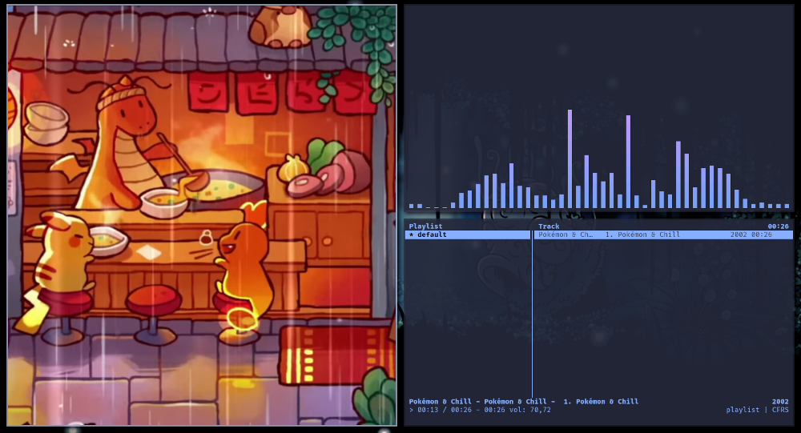

# 💾 Scripts

A personal collection of scripts. These scripts are used with
a tile window manager, but some ones can be used in other ambiences (e.g. org-capture).

## 🖥️ Description

### Org Mode

**org-capture**: based on GTD method and orgmode, capture some idea
to one refile file wherever in the system. It is better used with a rapid keybind;

### Pomodoro

**pomodoro-vanilla**: a customized pomodoro timer with optionsto
to work time, free time, stop and start music;

~~~bash
$./pomodoro -w 25 -r 25 -c 4 -p

 ░█▀█░█▀█░█▄█░█▀█░█▀▄░█▀█░█▀▄░█▀█ 
 ░█▀▀░█░█░█░█░█░█░█░█░█░█░█▀▄░█░█ 
 ░▀░░░▀▀▀░▀░▀░▀▀▀░▀▀░░▀▀▀░▀░▀░▀▀▀ 

Cycle #1 🍅️ [25 m] 
|===============>     | [70%]

...

$./pomodoro -h
~~~

### Cmus

**cmus-feh**: show the album cover via feh image viewer.

- *P.S.*: Original script from : [TiredSounds](https://github.com/TiredSounds/cmus-scripts)
- *P.S.*: Cover and music from  [CrispyDonut](https://www.youtube.com/watch?v=gvi0H2E-XcI)

### Rofi

- **rofi-dirs**: with rofi, search a big list of directories;
- **rofi-update-dirs**: update the list of directories used by *rofi_dirs.sh*;
- **rofi-power**: select the power options with rofi.

### Etc

- **autorun-nitrogen**: just start the nitrogen program;
- **autorun-volumeicon**: eliminate/start the volumeicon systray program;
- **nitrogen-slideshow**: select one random figure from the base
directory and apply it like wallpaper;

## 📦 Dependencies

Each script may need some common packages from GNU/Linux distros.
A list of these dependencies is:

- **autorun-nitrogen**: nitrogen;
- **nitrogen-slideshow**: nitrogen;
- **autorun-volumeicon**: volumeicon;
- **cmus-feh**: cmus and feh;
- **org-capture**: zenity;
- **pomodoro-vanilla**: zenity (and cmus to stop music);
- **rofi-dirs**: rofi, kitty, ranger and nemo;
- **rofi-update-dirs**: find;
- **rofi-power**: rofi and systemd.
